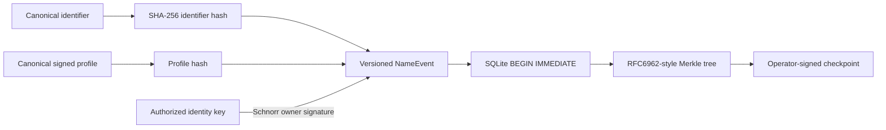
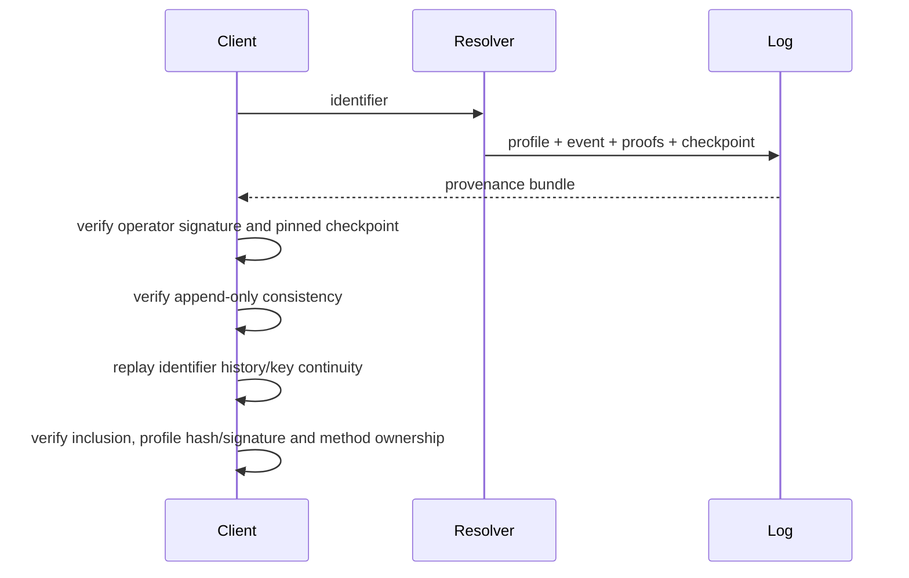
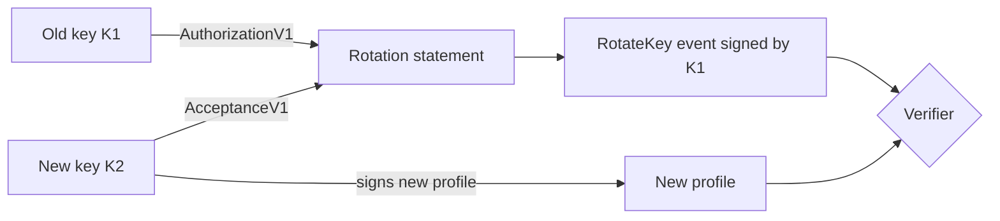
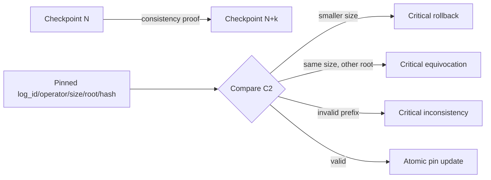
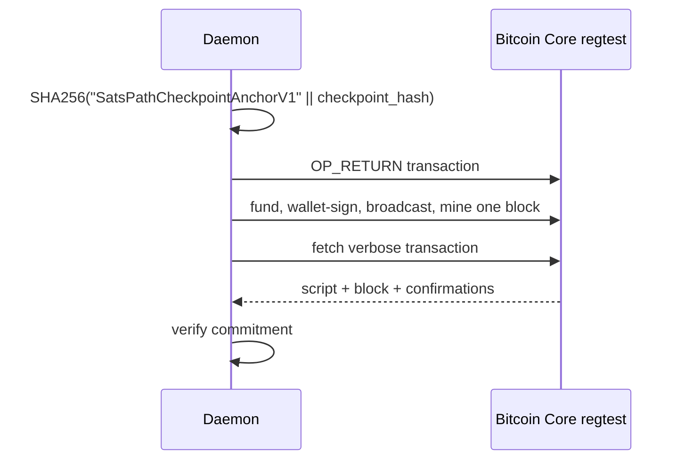
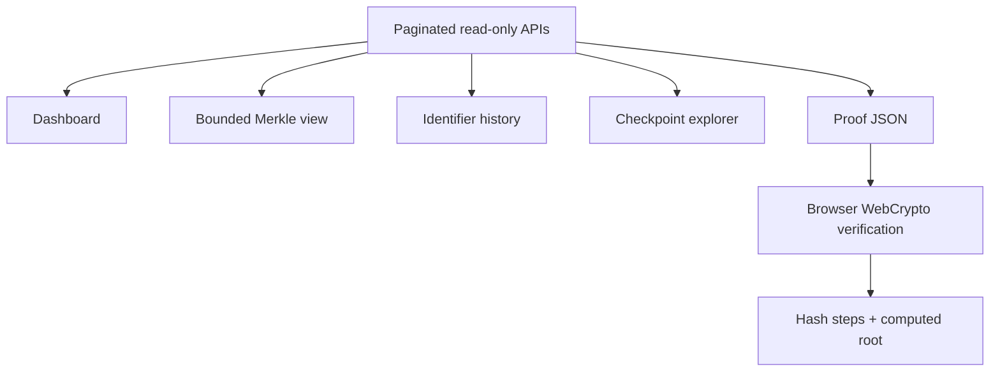

# SatsPath Key Transparency Architecture

## Problem

`self-signed profile != authenticated human-readable identity`. A malicious registry can replace Alice's key with an attacker key and return a profile correctly self-signed by that attacker. Profile-signature validity alone cannot detect the substitution.

V1 adds a per-identifier hash chain inside a global append-only Merkle log, signed checkpoints, client pinning, dual-signature rotation, identifier-to-key attestations and an opt-in Bitcoin Core regtest anchor. The authenticated current-state map is not implemented: state is replayed from the log and `map_root` is `null`.

## Event creation and Merkle construction



Startup deterministically replays every history and fails closed on corruption. Checkpoints use atomic rename. Events contain `identifier_hash`, not a plaintext consumer email. Recovery exists in the enum but is disabled.

```text
signing_payload_hash = SHA256(UTF8("SatsPathNameEventPayloadV1") || canonical_json_utf8(event_without_owner_signature))
owner_signature      = SchnorrSign(UTF8("SatsPathNameEventSignatureV1\n") || hex(signing_payload_hash))
signed_event_hash    = SHA256(UTF8("SatsPathSignedNameEventV1") || canonical_json_utf8(full_event_including_owner_signature))
leaf_hash            = SHA256(0x00 || raw_32_byte_signed_event_hash)
node_hash  = SHA256(0x01 || left_32 || right_32)
```

`previous_event_hash` and Merkle leaves use `signed_event_hash`, so the tree commits to the exact owner signature, rotation evidence, attestation hash and method-removal evidence. The exact profile and rotation encodings are in `protocol.md`.

## Resolution and proof verification



Inclusion verification is accepted only when proof root and size equal the exact signed checkpoint and the leaf equals `SHA256(0x00 || signed_event_hash)`. Consistency proofs use version 2 compact RFC 6962 audit paths with `O(log n)` bandwidth to independently prove that the old root is the exact prefix and the new root is the full tree. Bounded V1 consistency proofs (which carry all new-tree leaf hashes up to a cap of 16,384 leaves) are still verified for backward compatibility but are not generated by the daemon.

The resolver returns separate states for profile signature, identifier attestation, key continuity, inclusion, checkpoint consistency and payment-method ownership. Missing evidence never becomes a vague `verified: true`.

## Key rotation



Both statements bind identifier hash, old/new keys, previous signed-event hash, the exact canonical next sequence and timestamp. Registration is sequence 0 and `profile.sequence == event.sequence == rotation.sequence`. Direct self-signed replacement is rejected. No emergency recovery is invented.

## Checkpoint consistency and split views



Pins are indexed by a stable deployment `log_id`, never by an untrusted newly presented key. An operator key change requires a dual-signed `OperatorKeyRotation` bound to `log_id`, predecessor checkpoint hash and sequence. The operator signs every checkpoint field, including an optional Bitcoin receipt. `checkpoint_hash` excludes the signature and receipt to avoid a txid/checkpoint circular commitment; the post-anchor signature commits to the receipt. Operator signatures create attributable evidence, but global gossip remains future work. First contact is TOFU unless independently compared.

## Identifier attestations

`IdentifierAttestationV1` binds identifier hash, identity key, profile hash, random nonce, issuance/expiry, method and verifier key. The verifier signs canonical JSON under `SatsPathIdentifierAttestationV1`. Resolution checks the exact event binding and only trusts verifier keys listed in `SATSPATH_TRUSTED_VERIFIERS_JSON` with an allowed method. The current mock email challenge is not production verification; results report `identifier_verified: false` without a real trusted attestation.

## Regtest anchoring



Anchoring is never automatic. Authenticated `POST /v1/transparency/anchors` requires `SATSPATH_BITCOIN_NETWORK=regtest` plus `SATSPATH_BITCOIN_RPC_URL`, `SATSPATH_BITCOIN_RPC_USER` and `SATSPATH_BITCOIN_RPC_PASSWORD`. Mainnet is rejected and credentials are never logged. OP_RETURN provides public evidence but unrelated anchors do not fully prevent split views. Future Catena-style chaining would make transaction N spend a continuation output from N-1; it is not implemented.

## Explorer data flow



The embedded daemon UI reuses the existing stack, limits event rendering, supports pan/zoom and leaf selection, highlights proof material and verifies pasted inclusion proofs locally. It sends no private material to the browser.

## Persistence and API

Daemon security state uses `satspath-transparency-v1.sqlite3` in WAL mode with `synchronous=FULL`. A single `BEGIN IMMEDIATE` transaction inserts the event, upserts the profile, inserts the checkpoint and updates operator state; any error rolls back all four changes, and SQLite recovery discards incomplete transactions after a crash. Tables are schema-versioned for profiles, events, checkpoints, pins, anchors, attestations, operator state and migrations. On every open, deterministic replay verifies all histories plus every checkpoint signature, exact prefix root, predecessor, timestamp, operator continuity and anchor commitment. The legacy standalone registry remains for CLI compatibility but is not in the daemon quote/pay trust path.

## Mandatory payment resolution

The daemon uses one fail-closed flow for `/v1/resolve`, `/v1/quote`, `/v1/pay` and `/v1/preview`:

```text
identifier -> transparent profile -> profile/event binding
-> checkpoint-bound inclusion -> pinned checkpoint consistency
-> operator continuity -> method ownership allow-list -> router
```

The router receives only methods whose proof was cryptographically re-validated. Duplicate, expired, wrong-descriptor, wrong-network and self-asserted proofs are not selectable. If none pass, the response is `no_route`.

Read APIs cover status, paginated events/checkpoints, identifier/event/checkpoint lookup, inclusion/consistency proofs, local proof verification and stored anchors. Pages are capped at 200 records. Registry mutation is not publicly exposed.

## Threats and limitations

- Initial registration still needs an external identity attestation.
- First contact is TOFU unless a checkpoint/key fingerprint is independently verified.
- A compromised verifier can attest a false binding.
- A compromised current key can update, revoke or authorize rotation; transparency makes this visible but cannot undo it.
- A lost key has no recovery in V1. Email recovery reduces security to the email provider.
- A malicious operator can attempt split views; pinning detects local rollback/conflict, while gossip is future work.
- Bitcoin provides auditable evidence; unrelated OP_RETURNs do not provide Catena's single-history property.
- An authenticated current-state/non-inclusion map remains future work.
- This is experimental and unaudited. Do not use it with real funds.

Conceptual prior art: Zooko's Triangle, Certificate Transparency, CONIKS, Keybase, Catena and append-only authenticated data structures.
