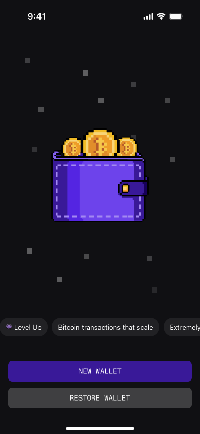
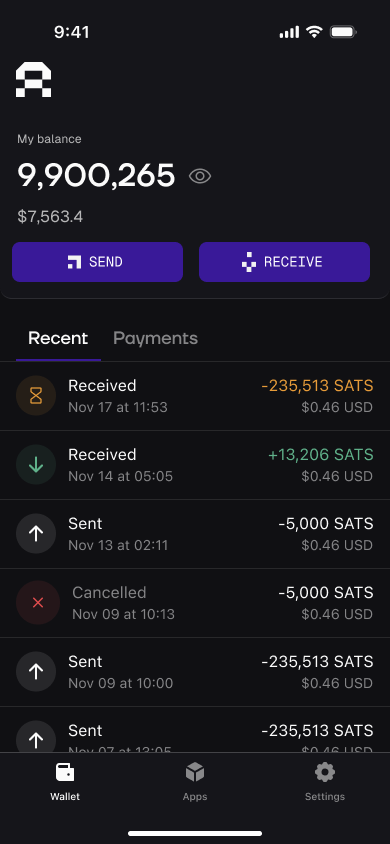

# 👾 Arkade Wallet

Arkade Wallet is the entry-point to the Arkade ecosystem—a self-custodial Bitcoin wallet delivered as a lightweight Progressive Web App (installable on mobile or desktop in seconds, no app-store gatekeepers). Built around the open-source ARK protocol, it speaks natively to any [arkd](https://github.com/arkade-os/arkd) instance, letting you create, send, and receive Virtual Transaction Outputs (VTXOs) for instant, off-chain pre-confirmations and batched, fee-efficient on-chain settlement.

## Screenshots

<!-- Using a table for more consistent layout -->
<table>
  <tr>
    <td width="50%" align="center">
      
    </td>
    <td width="50%" align="center">
      
    </td>
  </tr>
</table>

## Environment Variables

| Variable                      | Description                                                         | Example Value                                                                        |
| ----------------------------- | ------------------------------------------------------------------- | ------------------------------------------------------------------------------------ |
| `VITE_ARK_SERVER`             | Override the default Arkade server URL                              | `VITE_ARK_SERVER=http://localhost:7070`                                              |
| `VITE_APP_VERSION`            | App version string shown in support diagnostics                     | `VITE_APP_VERSION=1.2.3`                                                             |
| `VITE_CHATWOOT_WEBSITE_TOKEN` | ChatWoot website token for customer support integration             | `VITE_CHATWOOT_WEBSITE_TOKEN=your-token`                                             |
| `VITE_CHATWOOT_BASE_URL`      | ChatWoot server base URL for customer support integration           | `VITE_CHATWOOT_BASE_URL=https://app.chatwoot.com`                                    |
| `VITE_DELEGATOR_URL`          | Delegator service URL for the wallet service worker                 | `VITE_DELEGATOR_URL=https://delegator.example.com`                                   |
| `VITE_LENDASAT_IFRAME_URL`    | Override the default LendaSat URL                                   | `VITE_LENDASAT_IFRAME_URL=http://localhost:5173`                                     |
| `VITE_SATORA_IFRAME_URL`      | Override the default Satora URL                                     | `VITE_SATORA_IFRAME_URL=http://localhost:5174`                                       |
| `VITE_MAX_PERCENTAGE`         | Override the max fee percentage (default 10)                        | `VITE_MAX_PERCENTAGE=5`                                                              |
| `VITE_NOSTR_RELAY_URL`        | Override the default Nostr relay URLs for backup                    | `VITE_NOSTR_RELAY_URL=wss://relay.example.com`                                       |
| `VITE_PSA_MESSAGE`            | Message to show on the wallet index page                            | `VITE_PSA_MESSAGE=@arkade_os on TG for support`                                      |
| `VITE_SENTRY_DSN`             | Enable Sentry error tracking (only in production, not on localhost) | `VITE_SENTRY_DSN=your-sentry-dsn`                                                    |
| `VITE_UTXO_MAX_AMOUNT`        | Override the server's utxoMaxAmount                                 | `VITE_UTXO_MAX_AMOUNT=-1`                                                            |
| `VITE_UTXO_MIN_AMOUNT`        | Override the server's utxoMinAmount                                 | `VITE_UTXO_MIN_AMOUNT=330`                                                           |
| `VITE_VERIFIED_ASSETS_URL`    | URL to fetch the verified assets list                               | `VITE_VERIFIED_ASSETS_URL=https://arklabshq.github.io/asset-registry/mutinynet.json` |
| `VITE_VTXO_MAX_AMOUNT`        | Override the server's vtxoMaxAmount                                 | `VITE_VTXO_MAX_AMOUNT=-1`                                                            |
| `VITE_VTXO_MIN_AMOUNT`        | Override the server's vtxoMinAmount                                 | `VITE_VTXO_MIN_AMOUNT=330`                                                           |
| `CI`                          | Set to `true` for Continuous Integration environments               | `CI=true`                                                                            |
| `GENERATE_SOURCEMAP`          | Disable source map generation during build                          | `GENERATE_SOURCEMAP=false`                                                           |

## Docker

The wallet is available as a Docker image on GitHub Container Registry.

### Pull and run

```bash
docker pull ghcr.io/arkade-os/wallet:latest
docker run -p 8080:80 ghcr.io/arkade-os/wallet:latest
```

Open [http://localhost:8080](http://localhost:8080) to view the wallet.

### Runtime configuration

Environment variables can be passed at runtime to configure the wallet without rebuilding the image:

```bash
docker run -p 8080:80 \
  -e VITE_ARK_SERVER=https://arkade.computer \
  ghcr.io/arkade-os/wallet:latest
```

See the [Environment Variables](#environment-variables) table for all supported variables.

### Build locally

```bash
docker build -t arkade-wallet .

# With build-time configuration
docker build \
  --build-arg VITE_ARK_SERVER=https://arkade.computer \
  -t arkade-wallet .
```

## Content Security Policy

The policy is served by nginx (`nginx-security-headers.conf`) for Docker and by `public/_headers` for Cloudflare
Pages. Both are static, so:

- Setting `VITE_CHATWOOT_BASE_URL` to a host other than `https://app.chatwoot.com` requires adding that origin to
  `script-src` in the file your deployment uses.
- The inline theme bootstrap in `index.html` is allowed by hash. `pnpm csp:check` (run on pre-commit and before
  `pnpm build`) verifies it; `pnpm csp:fix` updates it after editing that block.
- `public/_headers` allows `https://static.cloudflareinsights.com` because Cloudflare Web Analytics injects its
  beacon into HTML responses at the edge, so the script is not in the build. Beware of Cloudflare features that
  inject _inline_ script — Rocket Loader, Email Obfuscation — which the hash-only `script-src` blocks and
  `pnpm csp:check` cannot catch, since it only sees the built `index.html`.

## Getting Started

### Prerequisites

- Node.js v24.15.0 (see `.nvmrc`)
- PNPM >=8

### Installation

Install dependencies

```bash
pnpm install
```

## Development

### `pnpm run start`

Runs the app in the development mode.\
Open [http://localhost:3002](http://localhost:3002) to view it in the browser.

The page will reload if you make edits.\
You will also see any lint errors in the console.

### `pnpm run build`

Builds the app for production to the `dist` folder.\
It correctly bundles React in production mode and optimizes the build for the best performance.

The build is minified and the filenames include the hashes.\
Your app is ready to be deployed!

### `pnpm run regtest:start`

Starts the regtest environment and sets up the arkd instance.\
Requires Docker and Node.js v20.19+ or v22.12+. The stack is driven by the in-house
`arkade-regtest` Node CLI (`regtest/regtest.mjs`) — no Nigiri required.

Use `pnpm run regtest:stop` to stop it and `pnpm run regtest:clean` to tear it down.

### Funding your local wallet

To interact with Ark features, you need Regtest coins.

1. Copy your address from the wallet's **Receive** screen (ensure it starts with bcrt1 for Regtest).
2. Run the faucet command (the `--confirm` flag mines a block so the deposit confirms):

```bash
node regtest/regtest.mjs faucet <bcrt-address> <btc> --confirm
```

### e2e tests

> note: e2e tests require a regtest environment to be running.
> `pnpm run regtest:start` to start and setup the regtest environment.

> note: e2e tests use playwright for ui testing, you may need to run
> `pnpm exec playwright install` once to download new browsers.

Run the tests with:

```bash
pnpm run test:e2e
```

Run the tests in interactive mode with:

```bash
pnpm run test:e2e --ui
```

Access the playwright code generator tool with:

```bash
pnpm run test:codegen
```

On CI the suite runs as four parallel jobs: two browser projects (`Mobile Chrome`,
`Google Chrome`) times two file groups defined in `.github/workflows/playwright.yml`:

- `assets-send`: `asset.test.ts`, `send.test.ts`
- `core`: every other file in `src/test/e2e/`

The groups list files explicitly, so **a new test file must be added to one of them**,
otherwise it will never run on CI.

## Troubleshooting

### `address already in use` (Port 5000) on macOS

macOS AirPlay Receiver uses port 5000 by default, which conflicts with the regtest stack.

- **Fix:** Go to `System Settings > General > AirDrop & Handoff` and disable **AirPlay Receiver**.
